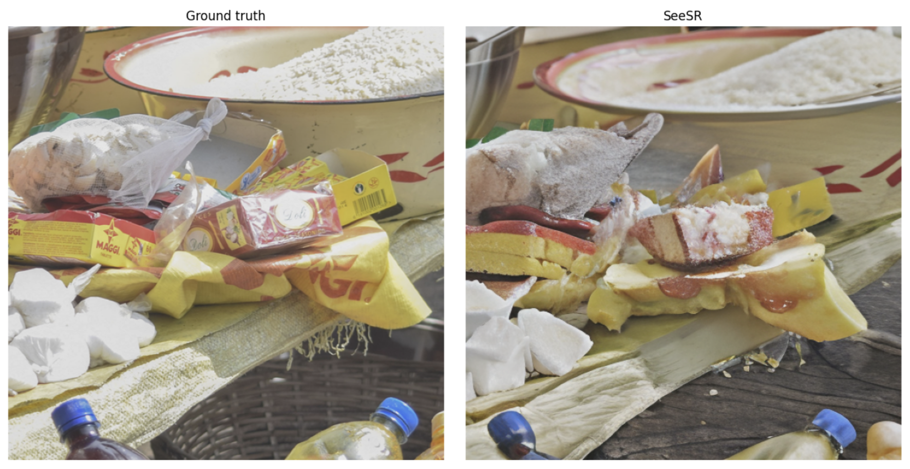
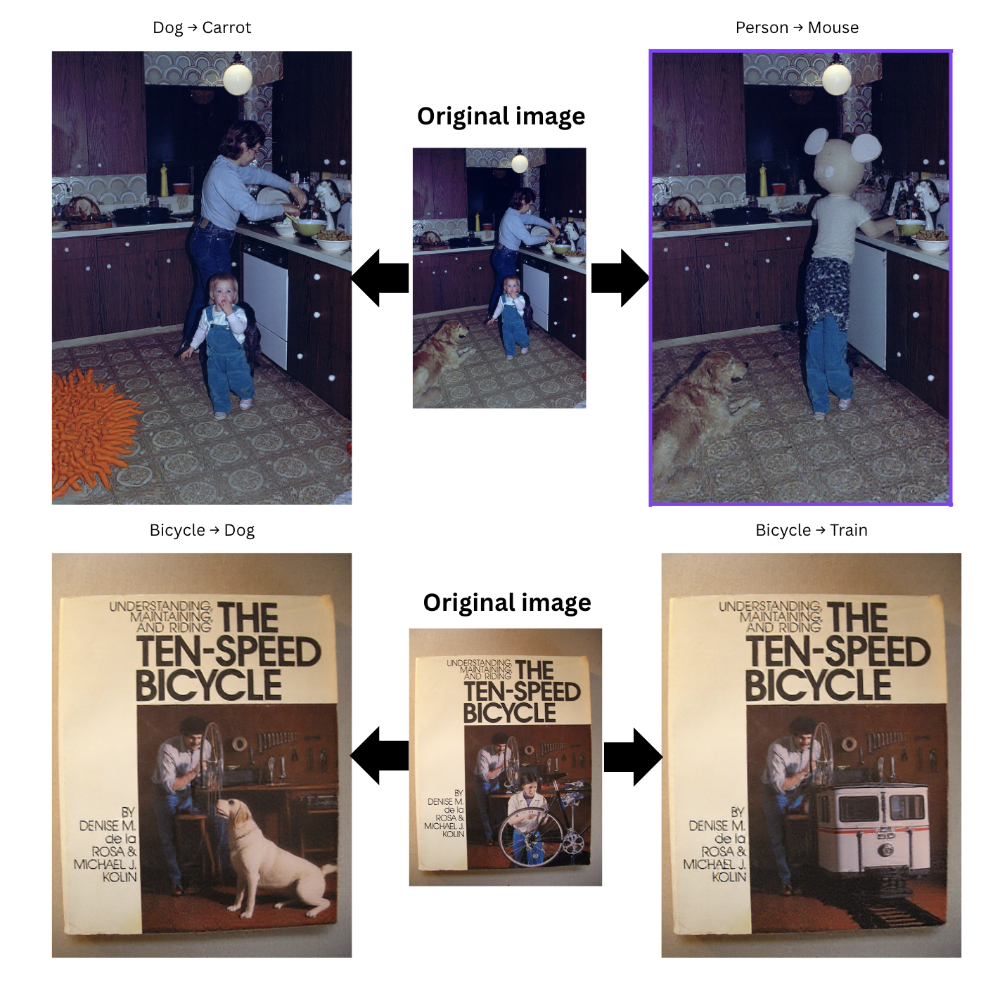
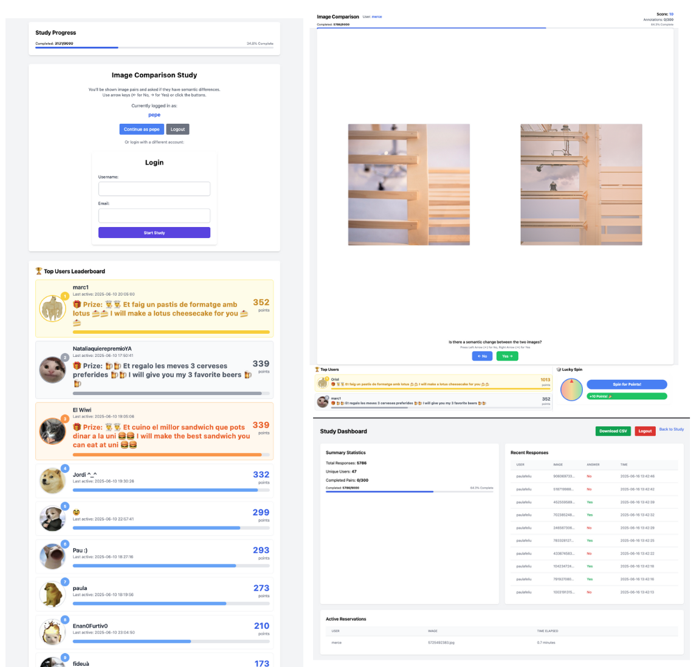
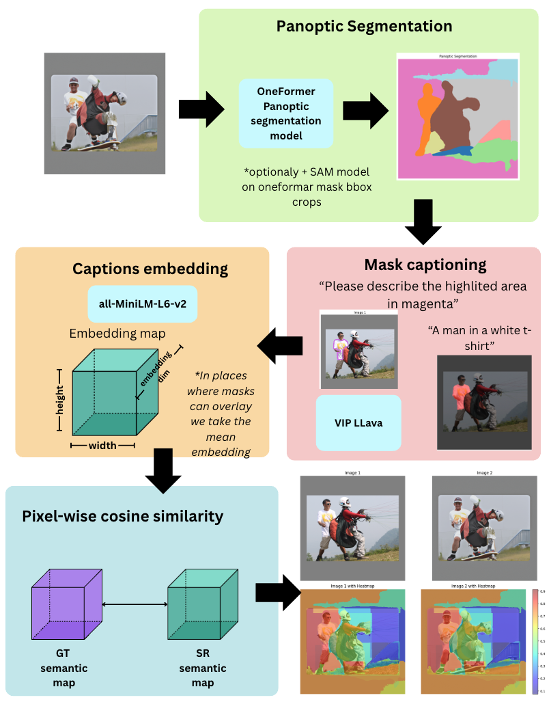
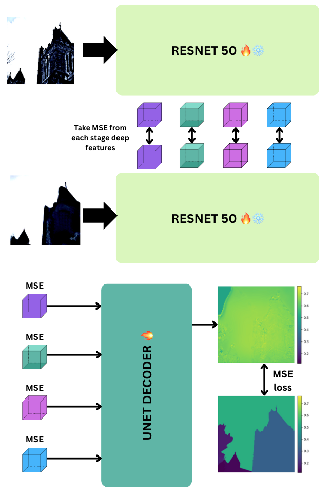
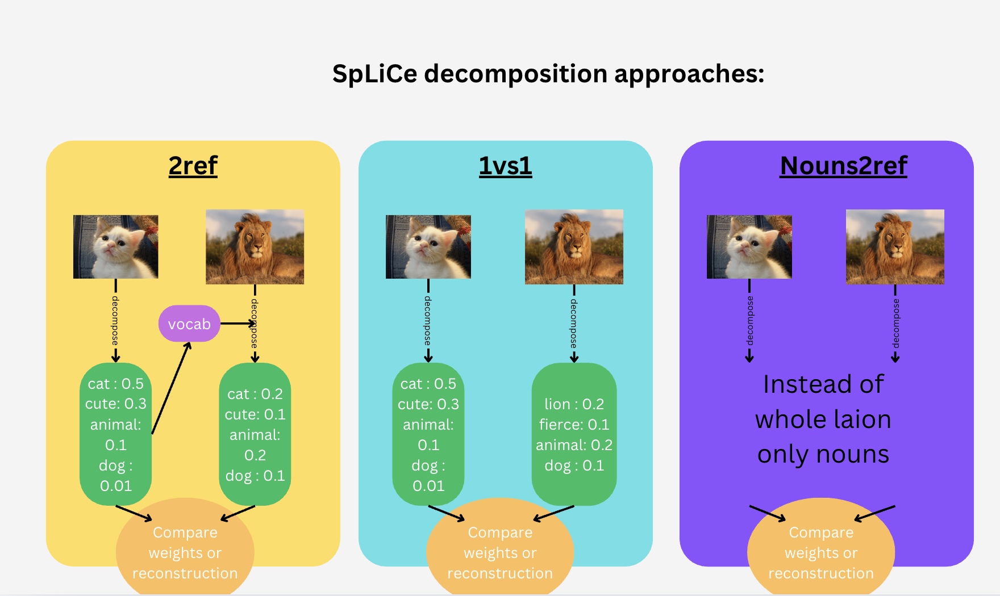

# Measuring Semantic Differences Between Images in the Super Resolution Domain

**Final Degree Project — UAB AI Engineering**  
**Author:** Josep Maria Rocafort  
**Supervisor:** Javier Vázquez Corral (Computer Vision Center)  
**Date:** June 27, 2025  

---

## 🚀 Project Summary

Current super-resolution (SR) metrics fail to capture semantic changes that may occur during image enhancement. For example, an SR model may change a "cigarette box" into a "red velvet cake" while maintaining high perceptual quality and pixel similarity.

This project introduces **semantic fidelity** as a new evaluation objective and proposes both **global** and **local** approaches to measure semantic changes. We also build two datasets and a user study to support metric development.

---

## 📷 Problem Illustration

> *Example: The red cigarette box (left) becomes a velvet cake (right) — a semantic shift not caught by classic metrics like PSNR or SSIM.*

---

## 📚 Datasets

### 1. 🖼️ COCO Inpainting Dataset

**Goal:** Generate images with controlled semantic changes (e.g., object substitutions).  
**Process:**

- Filter COCO 2017 images by size and quality
- Inpaint objects using **Flux 1.5-fill** diffusion model
- Object substitutions:
  - Same class (e.g., `bicycle → bicycle`)
  - Intra-supercategory (e.g., `bicycle → car`)
  - Inter-supercategory (e.g., `bicycle → toothbrush`)

**Example:**

---

### 2. 🔍 SR Outputs Dataset

**Goal:** Capture real SR-induced semantic errors.  
**Process:**

- Degrade **KonIQ-10k** images with BSRGAN pipeline
- Upscale with 5 SR models: **BSRGAN, SeeSR, StableSR, SwinIR, PASD**
- Filter outputs using SSIM, LPIPS, and KonIQ++ to keep perceptually moderate results
- Final set: **10,000** GT + SR image pairs

## 👥 User Study

**Goal:** Collect human labels of semantic differences.  
**Platform Features:**

- Login system, leaderboard, gamified evaluation (roulette, scores)
- Pairwise GT vs. SR comparison interface
- Admin panel with CSV export

**Interface Preview:**

- 300 image pairs
- ~30 responses per pair
- Quality control via "trap" images

The code to execute a user study like this one can be found here: https://github.com/Haradai/FunUserStudy

---

## 🌍 Global Semantic Fidelity Evaluation

### A. 🧪 Pseudo-labels

- **Caption2Caption (C2C):** Cosine similarity between GT and SR captions using MiniLM-L6-v2
- **Caption2Image (C2I):** Cosine similarity between GT caption and SR image embedding using CLIP

### B. 🧑‍🔬 CLIP-LPIPS Regressor

A regressor model inspired by LPIPS but uses **ResNet-50 backbones** (CLIP vs. ImageNet) to predict semantic error.

**Architecture Overview:**

- Extract deep features from ResNet
- Compute MSE between corresponding layers
- Aggregate with linear layers to produce a final semantic fidelity score

---

### 📊 Global Evaluation Results

| Pretraining | Dataset     | SRCC (↑) | MSE (↓) |
|-------------|-------------|----------|---------|
| CLIP ResNet | User Study  | 0.720    | 0.065   |
| ImageNet ResNet | User Study | **0.776** | **0.053** |

**Conclusion:** ImageNet-pretrained models outperform CLIP for detecting fine-grained semantic changes.

## 🧩 Local Semantic Fidelity Maps

### A. 🔎 Panoptic+Captions Embedding Map

**Pipeline:**

- Panoptic segmentation: **OneFormer**
- Region captioning: **VIP-LLava**
- Generate pixel-wise semantic maps using caption embeddings

---

### B. 🧠 CLU Model (CLIP LPIPS UNet)

- **Backbone:** ResNet-50  
- **Decoder:** UNet  
- **Trained on:** Inpainting dataset + semantic maps

**Architecture:**

### 📉 Local Method Limitations

- Generalization issues, some hallucinations
- ImageNet backbones offered sharper predictions
- Region captioning (VLM noise) a major bottleneck

---

## 🧪 Additional Approaches

### 🔬 SpLiCE Explainability (CLIP Decomposition)

- Decompose embeddings into concept vectors for interpretability

**Strategies:**

- **Symmetric:** Shared vocabulary for GT and SR  
- **Non-symmetric:** Full vocabulary  
- **Nouns2Ref:** Restricted to noun-based references

**Outcome:**  
Unstable and did not outperform direct intra-modal cosine similarity from CLIP.

---

## ✅ Conclusions

- Existing metrics miss important semantic shifts in SR
- Defined **semantic fidelity** and proposed:
  - A **global regressor** (best results with ImageNet backbone)
  - **Local maps** (proof-of-concept, still early)

**We built and validated:**

- 2 custom datasets
- A human-labeled user study platform
- Multiple training-free and learned metrics

---

## 🔮 Future Work

- Scale up the user study (more participants & images)
- Improve local map architecture and VLM captioning quality
- Integrate semantic fidelity into SR model training

---

## 📁 Folder Structure

